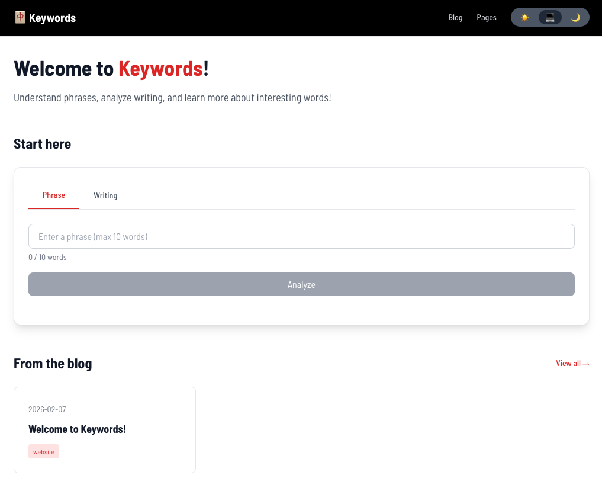
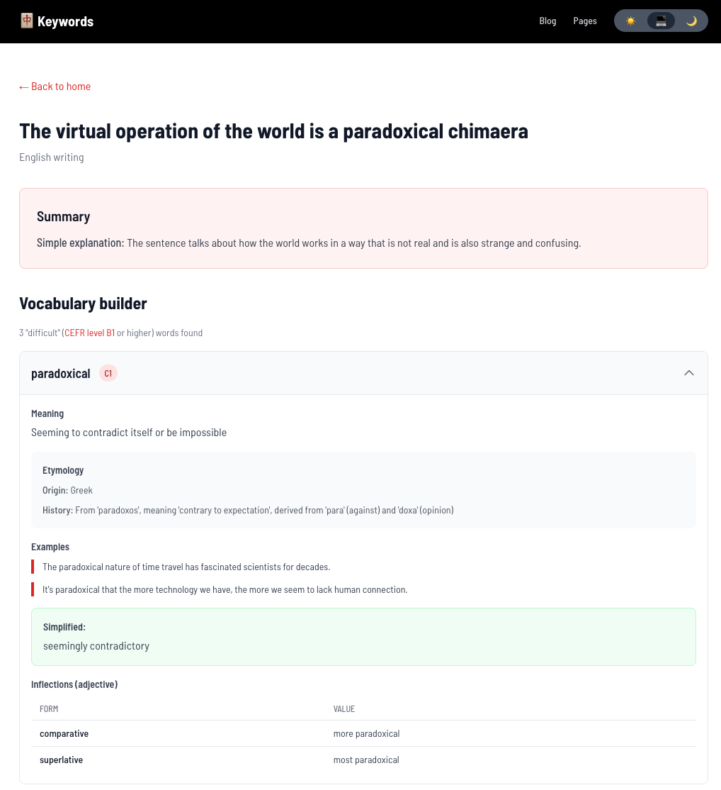
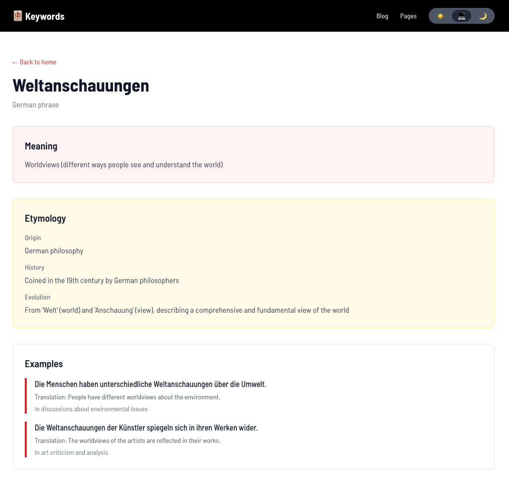

# Keywords

keying in our words to understand them better

an LLM-powered "**language analysis platform**" built with Next.js + Llama (AI), alongside a "blog" for writing about words: 



## Forewords

**Keywords** came from a wish to understand murky words like "paroxysm" and things like "sub specie corporis, sub specie realitatis"!

## Hallmarks 

- analyze phrases 
- analyze writing samples 
- explore etymology
- blog entries 
- static pages



### 🔍 Phrases (up to 10 words)
- **Origin**: find out where a word or phrase comes from!
- **Meaning**: a brief definition
- **Etymology**: word origin + history + evolution
- **Examples**: see how to use the term
- **Synonyms**: find alternative expressions with context
- **Inflections**: view grammatical forms (verb conjugations, noun cases, etc.)
- **Multilingual**: works with English, Japanese, Spanish, French, German, and more
- **Shareable**: share the result as a permalink (`/phrase?q=input`)



### ✍️ Writing (up to 50 words)
- **Automatic**: language identification
- **Summary**: simplified paraphrasing of original writing
- **Vocabulary builder**: detects words at [CEFR](https://www.google.com/search?udm=50&aep=26&kgs=fecc2be505c47392&shndl=37&shmd=H4sIAAAAAAAA_3WNOw7CMAxA6coROnVGoqYLA-IukZsYJ1J-cgzhdByAU1FmxPqk997-NexHSzeZIj0oTl2ChsxTw1QjtfHqVWu7APTeZ26KGuxsS4JGKNYfq5RUAEMyzaOQUX9Pa8YQ55r5sHsP5l8gJGRqsApmtx2BS-FIbFjQBcoKy_OHmc3PDsWZ5Xxy9fv4AFCSedHBAAAA&shmds=v1_ATWGeeOfNqyjnimmtI3vge348qSl21i8Gszatpsx8BmUdPWfEA&source=sh%2Fx%2Faio%2Fm1%2F1&mstk=AUtExfBAieV9BPJoSB_e7NqzfEdGJ21sCz5u7QQTR1hGBupsywVFNMH5-W1G2U1mz5FgUQC-G7BsY_PlojUjHpIE3bskj2Gr2lSxQsJufaTIeKU3KM8qrmDGo-hstvhpIkHbIHY-jJvNB8RfiSVJH42jQQAvRMKrCdPewHHGRRh_2XNMtlrNH1cJmBg0rgRSpJY5r7aKnjxC-afLKY-W_1JgsEy0cdimIVTDB7k1GrGqk7n0CK9mzABafstm1n4SfXjnIywrBrmzy2Hdk3EgnhYfAP8iFM-09EGPXY1PmBOCHCJz3uOJ29OeIIgXCL3R1VtTMXnncWa-YmeXDA&mtid=ROWIafSDK-yIptQPuaGquA0&csuir=1&q=Show+brief+two+sentence+English+writing+samples+for+each+CEFR+level%3A+A1%2C+A2%2C+B1%2C+B2%2C+C1%2C+C2&atvm=2) B2+ level or higher
  - **Collapsibles**: expandable word details for clean UX


### 📝 Blogging
- **Decap CMS**: Git-based headless CMS
- **Rich text editing**: TipTap editor with formatting, lists, links
- **Tag system**: Organize posts with tags and tag descriptions (comma separated values)
- **Forward-dating and back-dating**: Schedule posts for future publication
- **Dynamic routing**: SEO-friendly URLs for posts and tags
- **Markdown rendering**: write in Markdown if you wish!

### 📄 Static pages
- **CMS-managed**: Create and edit pages through CMS
- **Markdown content**: Full markdown support with syntax highlighting
- **Dynamic Routes**: Automatic page generation from CMS

### 🎨 UX
- **Dark mode**: System-aware theme switching with manual toggle
- **Responsive**: Mobile-first Tailwind CSS styling
- **Accessibility**: ARIA labels, skip links, keyboard navigation
- **Loading states**: Smooth loading indicators and transitions
- **404 pages**: Custom error page with navigation

### 🔲 Frameworks 

- **Structure**: [Next.js 16.1.6](https://nextjs.org/) (App Router, React 19, TypeScript)
- **Styling**: [Tailwind CSS 3.4.0](https://tailwindcss.com/) + [@tailwindcss/typography](https://tailwindcss.com/docs/typography-plugin)
- **LLM**: [Groq SDK 0.37.0](https://console.groq.com/) (llama-3.3-70b-versatile)
- **CMS**: [Decap CMS 3.10.0](https://decapcms.org/) (formerly Netlify CMS)
- **Content**: [gray-matter](https://github.com/jonschlinkert/gray-matter), [react-markdown](https://github.com/remarkjs/react-markdown), [remark-gfm](https://github.com/remarkjs/remark-gfm)
- **Theme**: [next-themes 0.4.6](https://github.com/pacocoursey/next-themes)
- **Animations**: [Framer Motion](https://www.framer.com/motion/)

## Runtimes

Run the build on either:

<a href="https://keywords.joncoded.com" target="_blank"><button>keywords.joncoded.com</button></a>

or

<a href="https://keywords-joncoded.vercel.app" target="_blank"><button>keywords-joncoded.vercel.app</button></a>

## Setup

This needs:

- Node.js 18+ and npm/yarn/pnpm
- [Groq API key](https://console.groq.com/) (free tier: 14,400 requests/day)

### clone repo

Run the following on "Terminal":

```bash
git clone https://github.com/joncoded/keywords.git && cd keywords
npm install
```

### setup `.env`

Make `.env.local` in the root:

```bash
GROQ_API_KEY=gsk_your_groq_api_key_here
```

Get your free API key at [https://console.groq.com/](https://console.groq.com/)

### start servers

In one terminal:
```bash
npx decap-server
```

In another terminal:
```bash
npm run dev
```

Open your browser:

- **Website**: [http://localhost:3000](http://localhost:3000)
- **CMS Admin**: [http://localhost:3000/admin](http://localhost:3000/admin)

## CMS

Instructions for local machine only: 

1. Go to [http://localhost:3000/admin](http://localhost:3000/admin)
2. **No login required in development**
3. Make/tweak:
   - **Blog posts**
   - **Static pages**
   - **Tag descriptions**
4. Click **"Publish"** to "save"
5. Content self-commits to the `content/` folder in the remote repo!
6. "Changes" show up right away

