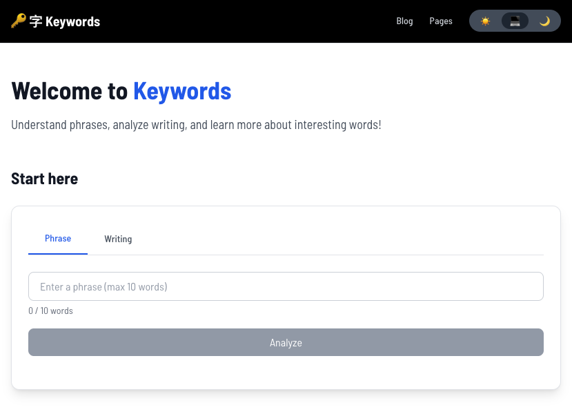
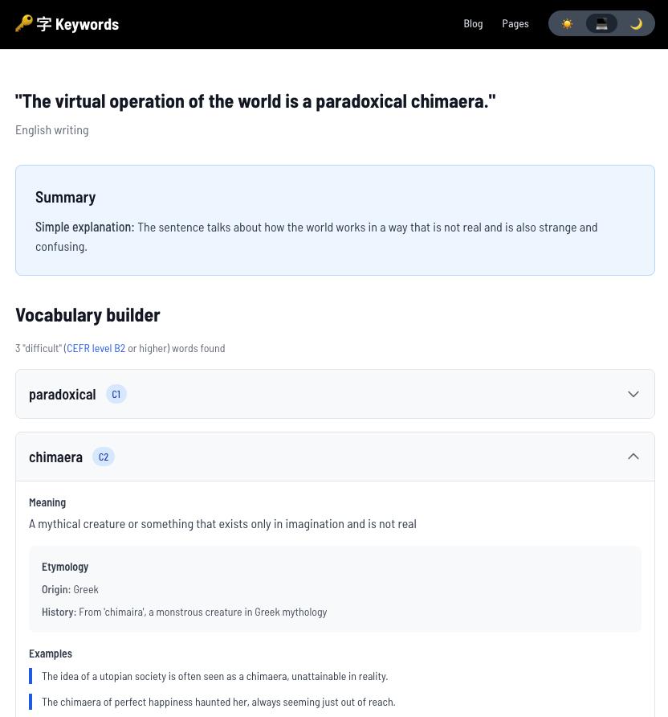
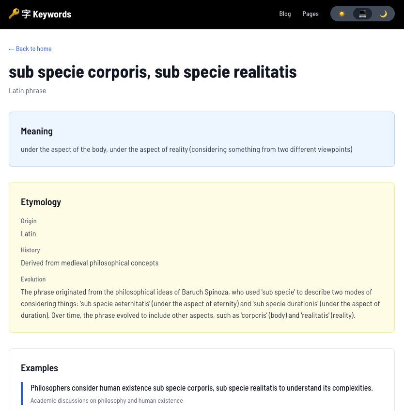

# Keywords



an LLM-powered **language analysis platform** built with Next.js + Llama (AI) + Decap CMS: 
- analyze phrases 
- analyze writing samples 
- explore etymology

also comes with the ability to publish:
- blog entries 
- static pages



## Features

### 🔍 Phrase analysis
- **Origin**: find out where a word or phrase comes from!
- **Meaning**: a brief definition
- **Etymology**: word origin + history + evolution
- **Examples**: see how to use the term
- **Synonyms**: find alternative expressions with context
- **Inflections**: view grammatical forms (verb conjugations, noun cases, etc.)
- **Multilingual**: works with English, Japanese, Spanish, French, German, and more
- **Shareable**: share the result as a permalink (`/phrase?q=input`)



### ✍️ Writing analysis (up to 50 words)
- **Automatic**: language identification
- **Summary**: simplified paraphrasing of original writing
- **Vocabulary builder**: detects words at [CEFR](https://www.google.com/search?udm=50&aep=26&kgs=fecc2be505c47392&shndl=37&shmd=H4sIAAAAAAAA_3WNOw7CMAxA6coROnVGoqYLA-IukZsYJ1J-cgzhdByAU1FmxPqk997-NexHSzeZIj0oTl2ChsxTw1QjtfHqVWu7APTeZ26KGuxsS4JGKNYfq5RUAEMyzaOQUX9Pa8YQ55r5sHsP5l8gJGRqsApmtx2BS-FIbFjQBcoKy_OHmc3PDsWZ5Xxy9fv4AFCSedHBAAAA&shmds=v1_ATWGeeOfNqyjnimmtI3vge348qSl21i8Gszatpsx8BmUdPWfEA&source=sh%2Fx%2Faio%2Fm1%2F1&mstk=AUtExfBAieV9BPJoSB_e7NqzfEdGJ21sCz5u7QQTR1hGBupsywVFNMH5-W1G2U1mz5FgUQC-G7BsY_PlojUjHpIE3bskj2Gr2lSxQsJufaTIeKU3KM8qrmDGo-hstvhpIkHbIHY-jJvNB8RfiSVJH42jQQAvRMKrCdPewHHGRRh_2XNMtlrNH1cJmBg0rgRSpJY5r7aKnjxC-afLKY-W_1JgsEy0cdimIVTDB7k1GrGqk7n0CK9mzABafstm1n4SfXjnIywrBrmzy2Hdk3EgnhYfAP8iFM-09EGPXY1PmBOCHCJz3uOJ29OeIIgXCL3R1VtTMXnncWa-YmeXDA&mtid=ROWIafSDK-yIptQPuaGquA0&csuir=1&q=Show+brief+two+sentence+English+writing+samples+for+each+CEFR+level%3A+A1%2C+A2%2C+B1%2C+B2%2C+C1%2C+C2&atvm=2) B2+ level or higher
  - **Collapsibles**: expandable word details for clean UX


### 📝 Blogging
- **Decap CMS**: Git-based headless CMS
- **Rich text editing**: TipTap editor with formatting, lists, links
- **Tag system**: Organize posts with tags and tag descriptions (comma separated values)
- **Forward-dating and back-dating**: Schedule posts for future publication
- **Dynamic routing**: SEO-friendly URLs for posts and tags
- **Markdown rendering**: write in Markdown if you wish!

### 📄 Static pages
- **CMS-managed**: Create and edit pages through CMS
- **Markdown content**: Full markdown support with syntax highlighting
- **Dynamic Routes**: Automatic page generation from CMS

## 🎨 UX
- **Dark mode**: System-aware theme switching with manual toggle
- **Responsive**: Mobile-first Tailwind CSS styling
- **Accessibility**: ARIA labels, skip links, keyboard navigation
- **Loading states**: Smooth loading indicators and transitions
- **404 pages**: Custom error page with navigation

## Technology
- **Framework**: [Next.js 16.1.6](https://nextjs.org/) (App Router, React 19, TypeScript)
- **Styling**: [Tailwind CSS 3.4.0](https://tailwindcss.com/) + [@tailwindcss/typography](https://tailwindcss.com/docs/typography-plugin)
- **LLM**: [Groq SDK 0.37.0](https://console.groq.com/) (llama-3.3-70b-versatile)
- **CMS**: [Decap CMS 3.10.0](https://decapcms.org/) (formerly Netlify CMS)
- **Content**: [gray-matter](https://github.com/jonschlinkert/gray-matter), [react-markdown](https://github.com/remarkjs/react-markdown), [remark-gfm](https://github.com/remarkjs/remark-gfm)
- **Theme**: [next-themes 0.4.6](https://github.com/pacocoursey/next-themes)
- **Animations**: [Framer Motion](https://www.framer.com/motion/)

## Setup

### Prerequisites

- Node.js 18+ and npm/yarn/pnpm
- [Groq API key](https://console.groq.com/) (free tier: 14,400 requests/day)

### Installation

1. **Clone the repository**

```bash
git clone https://github.com/joncoded/keywords.git && cd keywords
```

2. **Install dependencies**

```bash
npm install
```

3. **Set up environment variables**

Create `.env.local` in the project root:

```bash
GROQ_API_KEY=gsk_your_groq_api_key_here
```

Get your free API key at [https://console.groq.com/](https://console.groq.com/)

4. **Start the development servers**

In one terminal:
```bash
npx decap-server
```

In another terminal:
```bash
npm run dev
```

5. **Open your browser**

- **Website**: [http://localhost:3000](http://localhost:3000)
- **CMS Admin**: [http://localhost:3000/admin](http://localhost:3000/admin)

## Structure

```
keywords/
├── app/                      # Next.js App Router
│   ├── api/                  # API routes
│   │   ├── analyze-phrase/   # Phrase analysis endpoint
│   │   └── analyze-writing/  # Writing analysis endpoint
│   ├── blog/                 # Blog routes
│   │   ├── [slug]/           # Individual post pages
│   │   └── tag/[slug]/       # Tag filter pages
│   ├── pages/                # Static pages
│   │   └── [slug]/           # Dynamic CMS pages
│   ├── phrase/               # Phrase analysis page
│   ├── writing/              # Writing analysis page
│   ├── layout.tsx            # Root layout
│   └── page.tsx              # Home page
├── components/               # React components
│   ├── app/                  # Shared app components
│   │   ├── Collapsible.tsx
|   |   ├── Footer.tsx
|   |   ├── Header.tsx
│   │   ├── LoadingSpinner.tsx
│   │   ├── PageTransition.tsx
│   │   ├── ThemeProvider.tsx
│   │   └── ThemeToggle.tsx
│   └── home/                 # Home page components
│       ├── Tabs.tsx
│       ├── ParagraphForm.tsx
│       └── PhraseForm.tsx
│   
├── content/                  # Git-based content storage
│   ├── blog/                 # Blog posts (Markdown)
│   ├── pages/                # Static pages (Markdown)
│   └── tags/                 # Tag descriptions (Markdown)
├── lib/                      # Utility functions
│   ├── blog.ts               # Blog post handler
│   ├── cache.ts              # Results caching
│   ├── groq.ts               # Groq+LLM handler
│   ├── pages.ts              # Pages handler
│   └── rateLimit.ts          # Rate limiter for user queries
├── public/                   # Static assets
│   └── admin/                # Decap CMS admin panel
│       ├── config.yml        # CMS configuration
│       └── index.html        # CMS entry point
├── .env.local                # Environment variables (not committed)
├── package.json              # Dependencies
└── tailwind.config.ts        # Tailwind configuration
```

## For learners

### Phrase analysis (or simple word lookup)

1. Navigate to the home page
2. Click the **"Phrase"** tab
3. Enter a word or phrase (any language)
4. Click **"Analyze"**
5. View etymology, examples, synonyms, and inflections

**Example queries**:
- English: "serendipity"
- Japanese: "桜" (sakura)
- Spanish: "quijotesco"
- French: "déjà vu"

### Writing analysis (understanding sentences from a book)

1. Navigate to the home page
2. Click the **"Writing"** tab
3. Paste a paragraph or text sample
4. Click **"Analyze"**
5. Expand difficult words to see details

**Useful for**:
- Simplifying academic writing
- Teaching second-language students
- Assessing text readability
- Finding alternative vocabulary

## For editors

### Managing content (CMS)

Instructions for local machine only: 
1. Visit [http://localhost:3000/admin](http://localhost:3000/admin)
2. **No login required in development**
3. Create/edit:
   - **Blog posts**
   - **Static pages**
   - **Tag descriptions**: Optional tag explainers (on tag page header)
4. Click **"Publish"** to save
5. Content commits to `content/` directory
6. Changes appear immediately in development

## For developers

### Scripts

```bash
# Development server (with hot reload)
npm run dev

# Production build
npm run build

# Start production server
npm start

# TypeScript type checking
npm run type-check

# Linting
npm run lint
```

### Local CMS 

Run [Decap CMS](https://decapcms.org) and app locally:

```bash
# In one terminal
npx decap-server

# In another terminal
npm run dev
```

This starts the CMS backend on port `8081` and Next.js on port `3000` (where it will hot-reload upon each save!)

## API Routes

### POST /api/analyze-phrase

Analyze a phrase or word for linguistic information:

**Request**:
```json
{
  "phrase": "serendipity"
}
```

**Response**:
```json
{
  "phrase": "serendipity",
  "language": "English",
  "romanization": "Latin transliteration if necessary",
  "translation": "N/A",
  "meaning": "The occurrence of events by chance in a happy way",
  "etymology": {
    "origin": "Coined by Horace Walpole in 1754",
    "history": "...",
    "evolution": "..."
  },
  "examples": [...],
  "synonyms": [...],
  "inflections": null
}
```

### POST /api/analyze-writing

Analyze a text sample for difficult vocabulary:

**Request**:
```json
{
  "text": "The phenomenon of serendipitous discoveries..."
}
```

**Response**:
```json
{
  "originalText": "The phenomenon of...",
  "language": "English",
  "translation": "N/A",
  "summary": "...",
  "difficultWords": [
    {
      "word": "phenomenon",
      "cefrLevel": "B2",
      "romanization": "Latin transliteration if necessary",
      "definition": "...",
      "etymology": {...},
      "examples": [...],
      "rephrasing": "event or occurrence",
      "inflections": {...}
    }
  ]
}
```

### Deployment

**Quick steps**:
1. Push to GitHub
2. Deploy to Vercel (auto-detects Next.js)
3. Add `GROQ_API_KEY` environment variable
4. Set up Netlify Identity for CMS authentication
5. Invite users and start creating content!

### Configuration

#### Groq AI 

The AI uses the following settings (in `app/api/analyze-*/route.ts`):

```typescript
{
  model: "llama-3.3-70b-versatile",
  temperature: 0.3,
  max_tokens: 4000
}
```

Adjust `temperature` for creativity (0-1):
- `0.1-0.3`: More factual, consistent
- `0.7-1.0`: More creative, varied

#### CMS

Edit `public/admin/config.yml` to customize:

- Collections (blog, pages, tags)
- Fields (title, body, date, etc.)
- Widgets (string, text, markdown, image, etc.)
- Media folder location
- Editorial workflow settings

See [Decap CMS docs](https://decapcms.org/docs/configuration-options/) for full options.

#### Tailwind 

Customize theme in `tailwind.config.ts`:

```typescript
export default {
  theme: {
    extend: {
      colors: { ... },
      typography: { ... }
    }
  }
}
```

## Pipeline

Completed ✅:
- Phrase analysis with Groq AI
- Writing analysis with CEFR levels
- Blog with Decap CMS
- Tag system with descriptions
- Static pages system
- Dark mode toggle
- Responsive design
- Loading states
- Accessibility improvements
- 404 page
- Page transitions

Future enhancements 🚀:
- Search functionality
- Related posts suggestions
- Comment system
- Newsletter integration
- SEO meta tags
- Open Graph images
- Sitemap generation
- RSS feed
- Image optimization
- Rate limiting on API routes
- User favorites/bookmarks
- Export analysis results

## Troubleshooting

### Issue: Groq API errors

**Solution**: Check your API key and rate limits (14,400 requests/day free tier)

### Issue: CMS not loading

**Solution**: Ensure `decap-server` is running and check browser console for errors

### Issue: Dark mode not working

**Solution**: Clear browser cache, check system theme preference

### Issue: Build fails with TypeScript errors

**Solution**: Run `npm run type-check` to identify issues

### Issue: Tags not parsing correctly

**Solution**: Use comma-separated format: "tag1, tag2, tag3"

## Contributing

Contributions are welcome! Please:

1. Fork the repository
2. Create a feature branch (`git checkout -b feature/amazing-feature`)
3. Commit your changes (`git commit -m 'Add amazing feature'`)
4. Push to the branch (`git push origin feature/amazing-feature`)
5. Open a Pull Request

## License

This project is open source and available under the [MIT License](LICENSE).

## Acknowledgments

- **Groq**: Ultra-fast LLM inference
- **Decap CMS**: Git-based headless CMS
- **Next.js**: React framework
- **Vercel**: Deployment platform
- **Tailwind CSS**: Utility-first CSS

## Support

For questions or issues:

- 🐛 Open an issue on GitHub
- 💬 Discussions tab for Q&A
